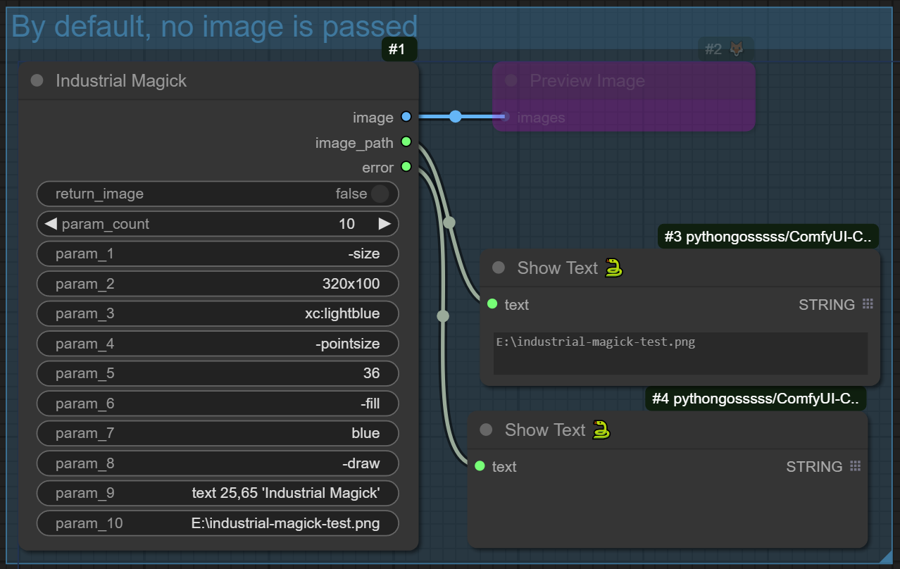
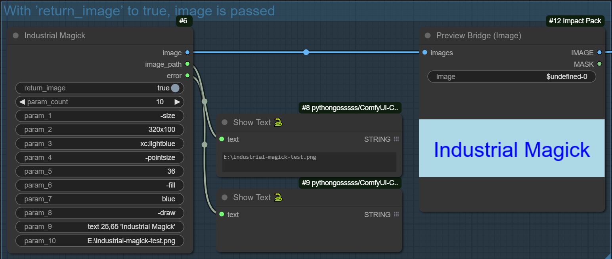
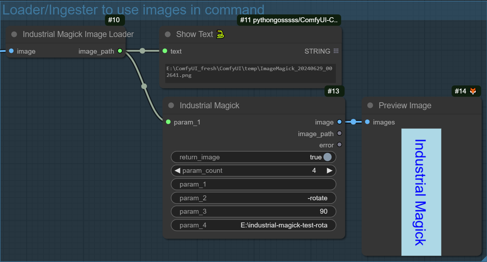

# ComfyUI IndustrialMagick

[ImageMagick](https://imagemagick.org/index.php) nodes for ComfyUI.

Adds nodes to call ImageMagick subprocesses from ComfyUI.

## Requirements

- ImageMagick \
  Downloads: [ImageMagick 7](https://imagemagick.org/script/download.php)
- `magick` command in your CLI environment. 

## Nodes

### IndustrialMagick

  The main node. Lets you build a subprocess call token by token. \
  Supports up to 50 tokens.

  Expects an absolute image path as last parameter.

  | Input | Type | Note |
  | - | - | - |
  |return_image| boolean | The node will read from file and return an image when set to true.
  |param_count| integer (1-50) | Number of parameter fields to display. |
  | param_x | string | Token parameter as used by python subprocess.run(). |
  
  | Output | Type | Note |
  | - | - | - |
  |image| image or None | Returns an image if `return_image` is `True`.
  |image_path| string | The path to the saved image. It’s actually the value of the last parameter |
  |error | string | A string that says the subprocess failed. Used to determine completion status |

  
  

### IndustrialMagickImageIngest

  A.K.A.: Industrial Magick Image *Loader*

  A nodes that takes an image as input, saves as a temporary file and returns the temp file path to use in the `IndustrialMagick` node.

  
